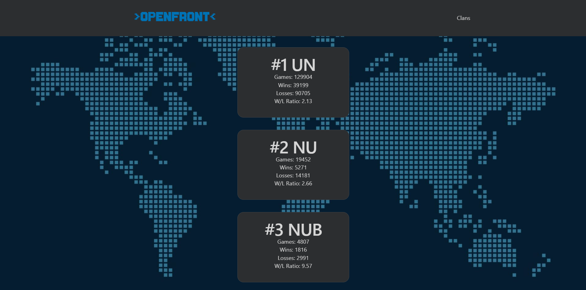

# Openfront Leaderboard
This is a learn project to be more comfortable in the usage of typescript. 
Since I have done my first pr to the official Openfront, I wanted to do something in the same niche.

## What does it do
For now, it pulls the best 10 OpenFront Clans from the api (only works with the local vite proxy) and displays those in cards under eachother.
Im currently working on a better visual appeall.

## Preview

## What I learned so far
I have already learned quite a lot:
- fetching data
- use fetched data
- interfaces
- types
- storing data in array
- displaying data in a loop
- rendering html with typescript
- typecasting
- error handling
- async functions
- seperation of concerns

## What the future holds
In future I want to add more features, for example a game replay, player stats, etc.
I may also deploy it on my own site and code a php proxy, since the api only works with openftront.io as its base url.

## Ai ussage
I have used claude to guide me in the learning project, since im a complete beginner but like a more project oriented path.
All the code is written by me but with said guidance.

I want to point out that I thought about it myself and extented the code over time.
